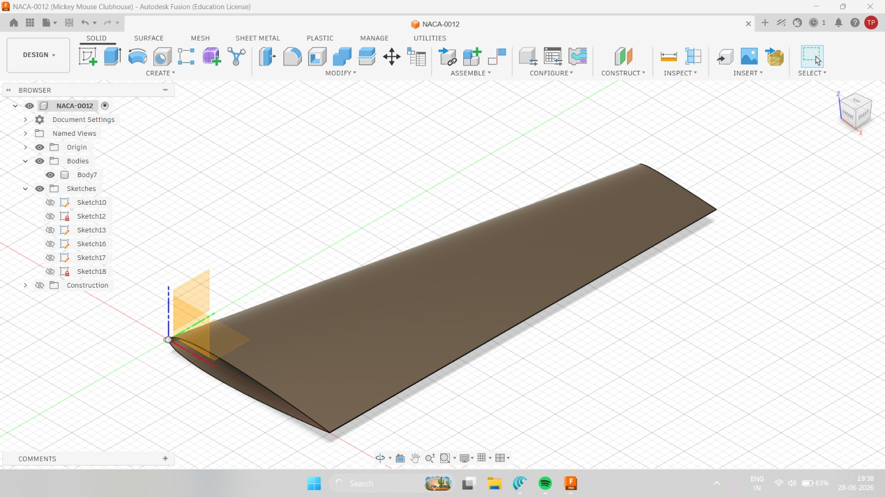

NACA 0012 → NACA 2412 Tapered Wing — CAD Model
Tool: Autodesk Fusion 360
Description: Designed a tapered aircraft wing section using two different NACA 4-digit aerofoil profiles — NACA 0012 at the root and NACA 2412 at the tip — lofted into a single solid body, then shelled to simulate a realistic aircraft wing skin.
Specifications:

Root aerofoil: NACA 0012, 25 cm chord
Tip aerofoil: NACA 2412, ~13 cm chord
Wingspan: 60 cm
Construction method: Solid Loft between root and tip profile sketches
Wall thickness: 1.5 mm (shelled)
Material: Aluminum 2024-T3 (standard aerospace skin alloy)

Results:
Mass : 94.34 g, Volume : 33.946 cm³, Surface area : 4531.34 cm², Density : 2.779 g/cm³
