# 3D CFD Analysis of NACA 0012 and NACA 2412 Finite Wings

A validated 3D CFD study comparing a symmetric (NACA 0012) and cambered (NACA 2412) wing of identical planform, using Ansys Fluent, cross-checked against 2D XFLR5 polars and finite-wing (lifting-line) theory.

## Overview

| | Value |
|---|---|
| Chord | 250 mm |
| Span | 600 mm |
| Aspect ratio | 2.4 |
| Angle of attack | 5° (more coming — see Future Work) |
| Freestream velocity | 60 m/s |
| Reynolds number | ≈ 1,000,000 |
| Turbulence model | k-ω SST |
| Domain | Half-span (symmetry at root), ~15-30 chords farfield |

## Why two airfoils?

Same planform, two sections — NACA 0012 (symmetric) and NACA 2412 (2% camber) — isolates the effect of camber on lift and drag at identical geometry and flow conditions.

## Methodology

1. **2D baseline (XFLR5):** Polars generated at Re = 1,000,000 for both airfoils, used to derive lift-curve slope and zero-lift angle of attack.
2. **Finite-wing correction:** Prandtl lifting-line theory used to predict the 3D lift slope from the 2D slope and aspect ratio, giving a theoretical target Cl at 5° AoA before running any CFD.
3. **3D CFD (Ansys Fluent):** Half-span wing in a large farfield domain, structured inflation layers on the wing surface (y+ tuned for wall-function treatment with SST k-ω), tetrahedral core mesh, mesh quality checked via skewness histograms.
4. **Validation:** Converged Cl/Cd compared against the theoretical target from step 2.

## Repository structure

Geometry, mesh, and 2D polar data are shared across all angles of attack (they don't change with AoA). Fluent setup, results, and post-processing are organized per airfoil, then per angle of attack, so additional AoA points can be added later without restructuring.

```
naca-3d-cfd-comparison/
├── geometry/                  (shared)
├── mesh/                      (shared)
├── xflr5-data/                (shared)
├── naca0012/
│   └── aoa_5/
└── naca2412/
    └── aoa_5/
```

## Geometry and domain

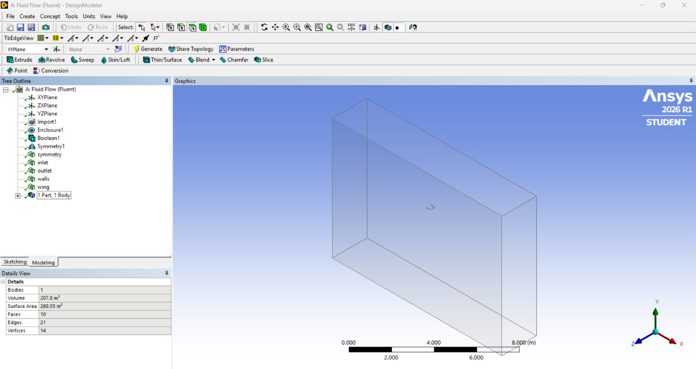
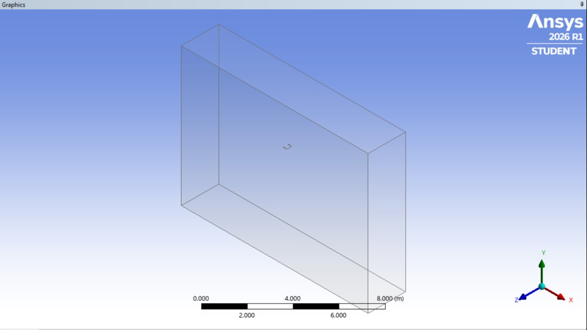

## Mesh

Leading-edge close-up showing inflation layers:

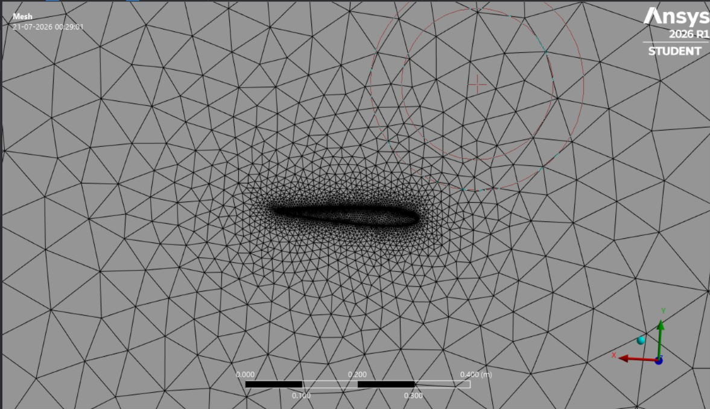
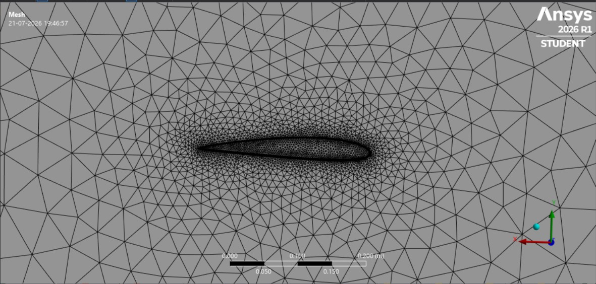

Skewness histograms (Wed6 = inflation prisms, Tet4 = bulk tetrahedra):

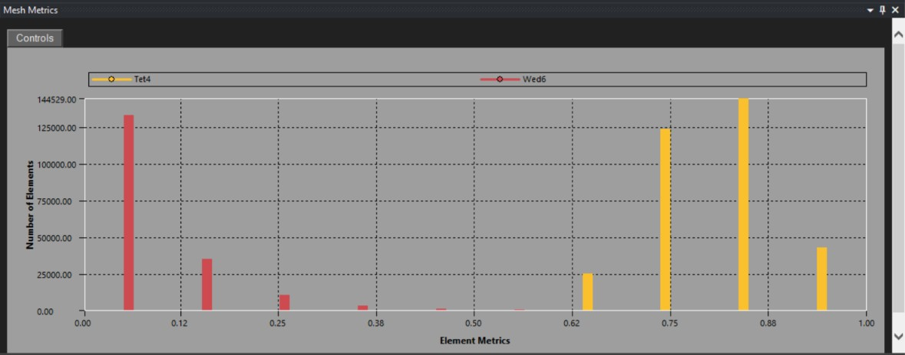
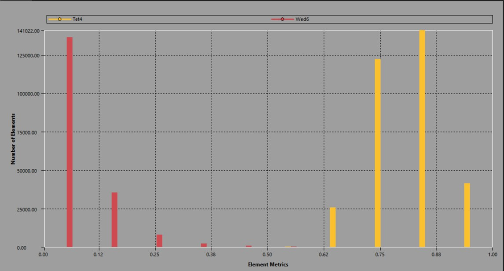

## Fluent setup — α = 5°

Boundary conditions:

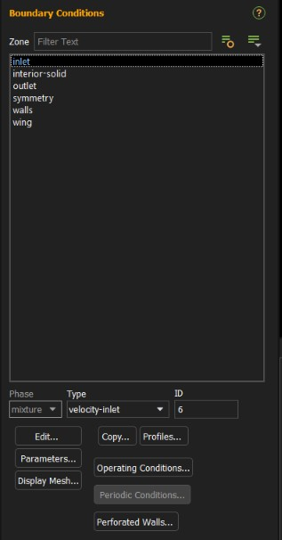
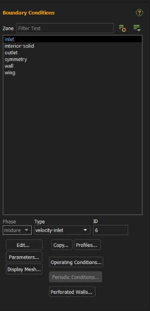

## Convergence — α = 5°

Residuals:

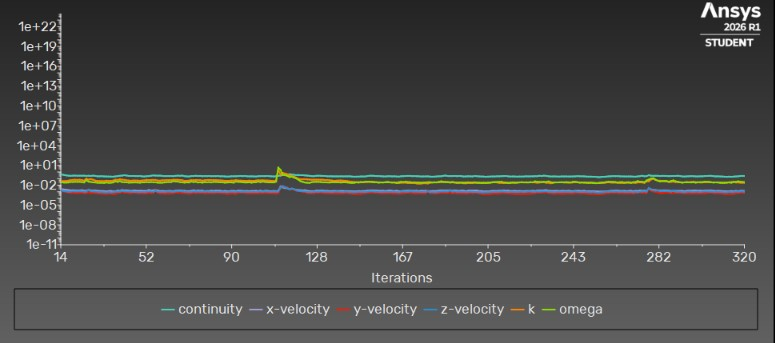
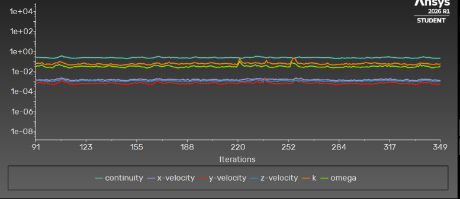

Cl monitor:

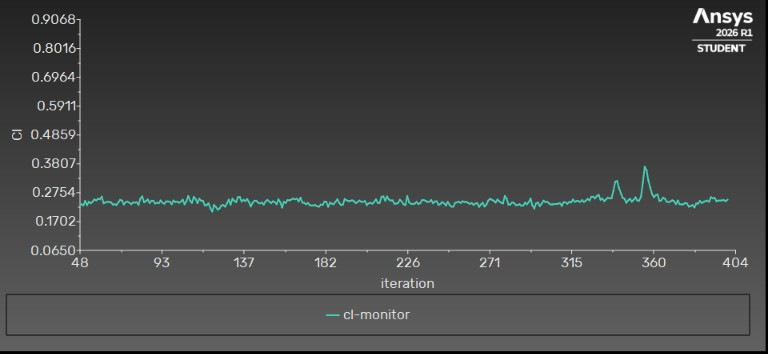
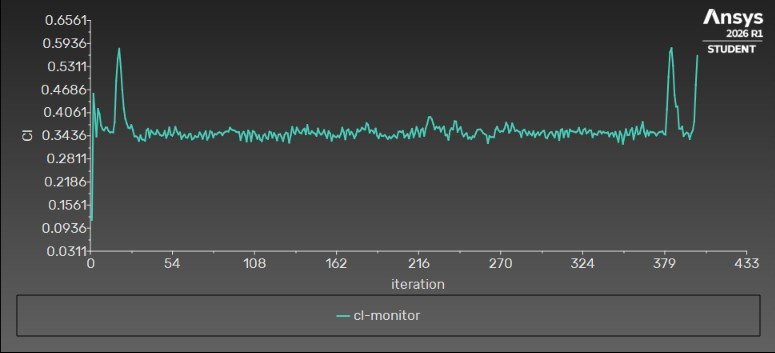

Cd monitor:

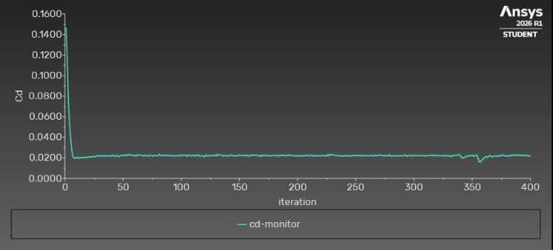
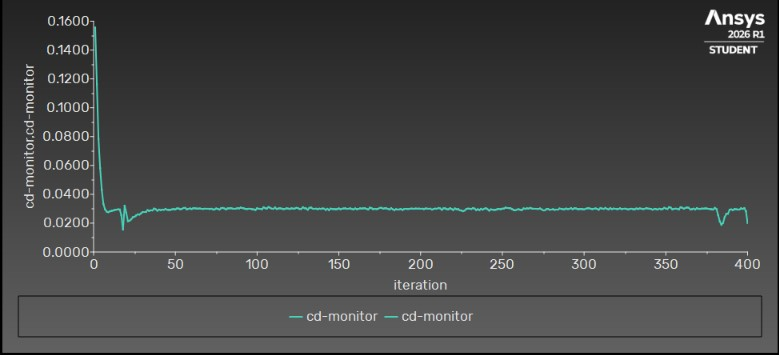

Wall y+ on the wing surface:

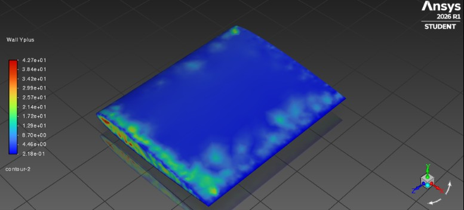
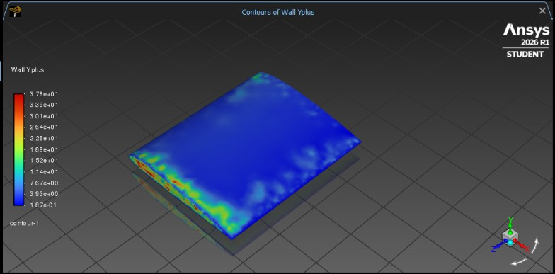

## Results (α = 5°, V = 60 m/s)

| Airfoil | Cl (CFD, time-averaged) | Cl (theory) | Cd (CFD) |
|---|---|---|---|
| NACA 0012 | ≈ 0.27 | 0.30 | ≈ 0.021 |
| NACA 2412 | ≈ 0.50 | 0.42 | ≈ 0.020 |

NACA 2412 shows clearly higher lift than NACA 0012 at the same angle of attack — the expected camber effect. Both results sit within a reasonable margin of the simplified lifting-line prediction; the gap is consistent with known limitations of that theory at low aspect ratio (AR = 2.4), where lifting-line theory is less accurate, and with camber pushing NACA 2412 further into the nonlinear part of its lift curve at this AoA.

## Post-processing — α = 5°


## Notes on convergence

Cd converged cleanly to a flat line for both cases. Cl showed a bounded oscillation (roughly ±0.05 around the mean, with occasional transient spikes), consistent with the inherently less steady behavior of tip-vortex-dominated flow on a low-aspect-ratio wing in steady RANS. Reported Cl values are averaged over a stable iteration window, excluding transient spikes.

## Tools used

Ansys Fluent (Student, 2026 R1), XFLR5, Ansys DesignModeler/Meshing

## Future work

- Full AoA sweep (-2° to stall) for both airfoils to build complete Cl-α and Cd-α curves — each new angle will be added as its own `aoa_X` folder under `naca0012/` and `naca2412/`
- Mesh independence study
- Spanwise Cl distribution extraction
