# 3D CFD Analysis of NACA 0012 and NACA 2412 Finite Wings

A validated 3D CFD study comparing a symmetric (NACA 0012) and cambered (NACA 2412) wing of identical planform, using Ansys Fluent, cross-checked against 2D XFLR5 polars and finite-wing (lifting-line) theory across a full angle-of-attack sweep.

## Overview

| | Value |
|---|---|
| Chord | 250 mm |
| Span | 600 mm |
| Aspect ratio | 2.4 |
| Angle of attack sweep | -4°, -2°, 0°, 2°, 5°, 8°, 10°, 12° |
| Freestream velocity | 2D — 30 m/s · 3D — 60 m/s |
| Reynolds number | ≈ 1,000,000 |
| Turbulence model | k-ω SST |
| Domain | Half-span (symmetry at root), ~15–30 chords farfield |

## Why two airfoils?

Same planform, two sections — NACA 0012 (symmetric) and NACA 2412 (2% camber) — isolates the effect of camber on lift and drag at identical geometry and flow conditions.

## Methodology

1. **2D baseline (XFLR5):** Polars generated at Re = 1,000,000 for both airfoils, used to derive lift-curve slope and zero-lift angle of attack.
2. **Finite-wing correction:** Prandtl lifting-line theory used to predict the 3D lift slope from the 2D slope and aspect ratio, giving a theoretical target Cl at each angle of attack before running any CFD.
3. **3D CFD (Ansys Fluent):** Half-span wing in a large farfield domain, structured inflation layers on the wing surface (y+ tuned for wall-function treatment with SST k-ω), tetrahedral core mesh, mesh quality checked via skewness histograms. Freestream velocity of 60 m/s used to match Re = 1,000,000 given the Student-license mesh constraints.
4. **Validation:** Converged Cl/Cd at each angle compared against the theoretical target from step 2, across the full sweep.

## Repository structure

Geometry, mesh, and 2D polar data are shared across all angles of attack (they don't change with AoA). Fluent setup, results, and post-processing are organized per airfoil, then per angle of attack.

naca-3d-cfd-comparison/
├── geometry/ (shared)
├── mesh/ (shared)
├── xflr5-data/ (shared)
├── AoA_Sweep_Tracker.xlsx (full sweep data, both airfoils)
├── naca0012/
│ ├── aoa_-4/ ... aoa_12/
└── naca2412/
├── aoa_-4/ ... aoa_12/

## Geometry and domain

#### NACA-0012
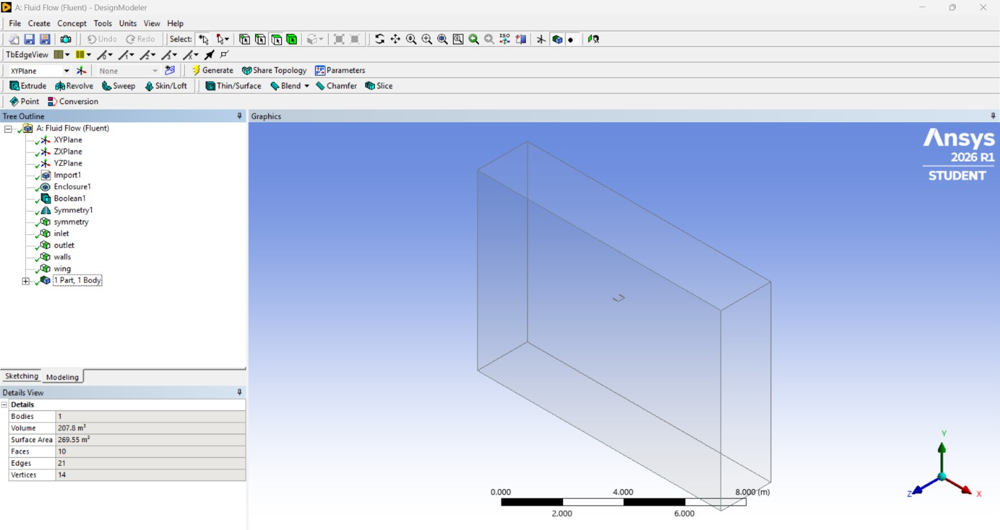

#### NACA-2412
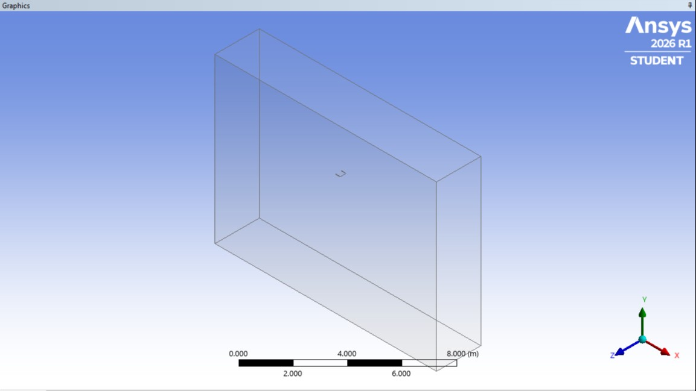

## Mesh

Leading-edge close-up showing inflation layers:

#### NACA-0012
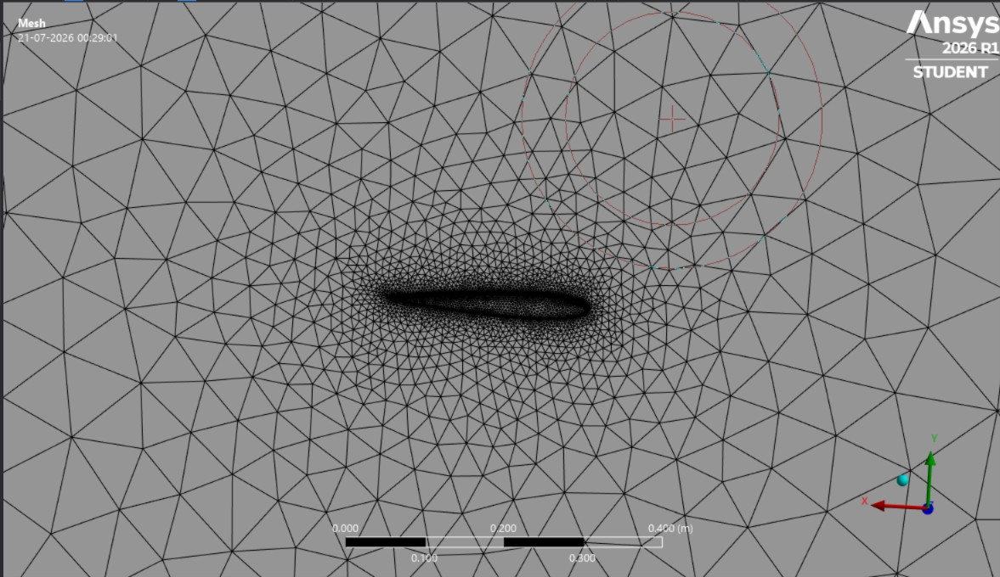

#### NACA-2412
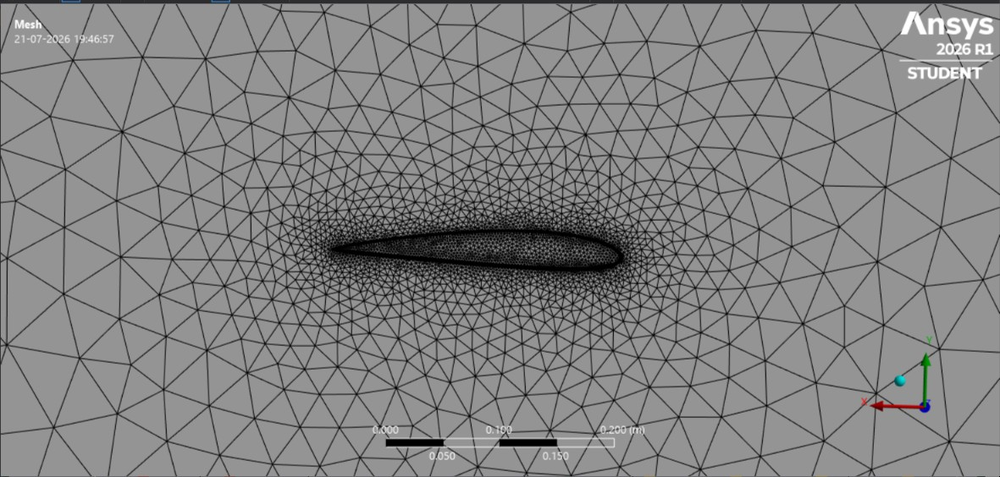

Skewness histograms (Wed6 = inflation prisms, Tet4 = bulk tetrahedra):

#### NACA-0012
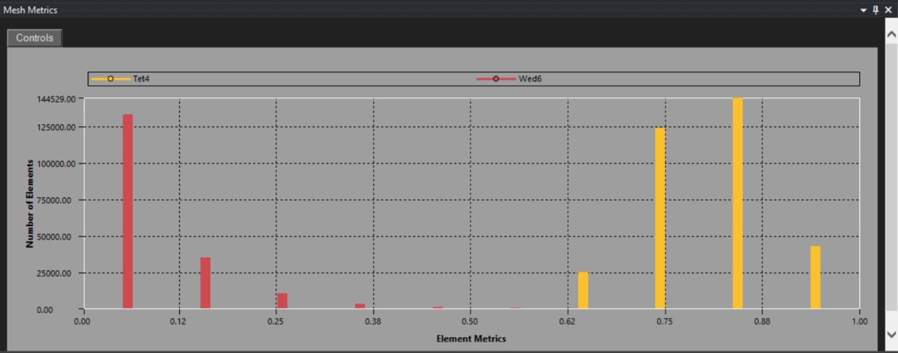

#### NACA-2412
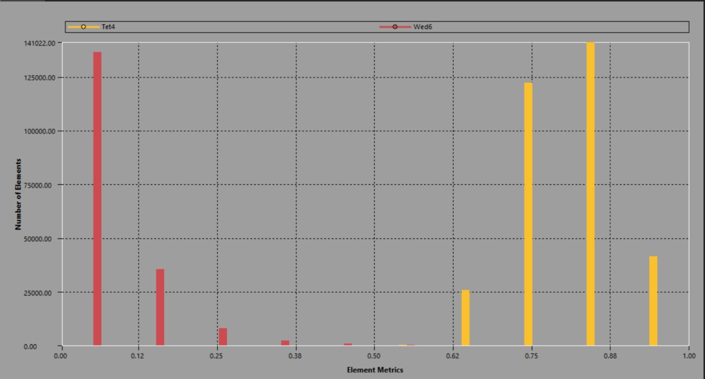

## Full AoA sweep results

Raw data and derivation (velocity components, direction vectors, theory calculation) available in [`AoA_Sweep_Tracker.xlsx`](AoA_Sweep_Tracker.xlsx).

### NACA 0012 — Cl and Cd vs Angle of Attack

| AoA (°) | Cl (theory) | Cl (CFD) | % diff | Cd (CFD) |
|---|---|---|---|---|
| -4 | -0.242 | -0.206 | -14.9% | 0.018 |
| -2 | -0.121 | -0.100 | -17.4% | 0.015 |
| 0 | 0.000 | 0.000 | — | 0.012 |
| 2 | 0.121 | 0.097 | -19.8% | 0.013 |
| 5 | 0.303 | 0.250 | -17.5% | 0.022 |
| 8 | 0.484 | 0.394 | -18.6% | 0.037 |
| 10 | 0.605 | 0.510 | -15.7% | 0.050 |
| 12 | 0.726 | 0.597 | -17.8% | 0.067 |

### NACA 2412 — Cl and Cd vs Angle of Attack

| AoA (°) | Cl (theory) | Cl (CFD) | % diff | Cd (CFD) |
|---|---|---|---|---|
| -4 | -0.058 | -0.103 | +77.6% | 0.016 |
| -2 | 0.020 | 0.000 | -100% | 0.014 |
| 0 | 0.134 | 0.105 | -21.6% | 0.014 |
| 2 | 0.248 | 0.221 | -10.9% | 0.018 |
| 5 | 0.420 | 0.560 | +33.3% | 0.020 |
| 8 | 0.591 | 0.515 | -12.9% | 0.049 |
| 10 | 0.706 | 0.600 | -15.0% | 0.074 |
| 12 | 0.820 | 0.726 | -11.5% | 0.085 |

### Observations across the sweep

For **NACA 0012**, CFD Cl consistently sits 15–20% below the lifting-line theory prediction across nearly every angle — a fairly uniform offset, suggesting the finite-wing correction itself (rather than a flow feature at any one angle) accounts for most of the gap at this low aspect ratio (AR = 2.4), where lifting-line theory is known to be less accurate.

For **NACA 2412**, the picture is noisier: near-zero lift angles (-2°, 0°) show large percentage deviations because the absolute Cl values are small — a tiny absolute difference produces a large percentage swing. At 5° the CFD value (0.56) actually exceeds theory (0.42), the opposite trend to every other point; this is flagged for further investigation rather than accepted at face value — possible causes include residual transient oscillation at that specific run (see convergence notes below) or a locally non-linear camber effect not captured by simple lifting-line theory.

Cd increases with angle of attack for both airfoils as expected, roughly tracking the CL² induced-drag trend, with NACA 2412 showing marginally lower Cd than NACA 0012 at matched angles below stall onset — consistent with the cambered section operating closer to its ideal lift condition across this range.

## Fluent setup — α = 5° (representative case)

Boundary conditions:

#### NACA-0012
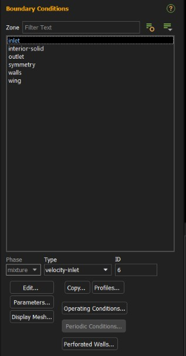

#### NACA-2412
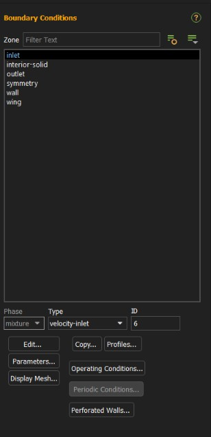

## Convergence — α = 5° (representative case)

Residuals:

#### NACA-0012
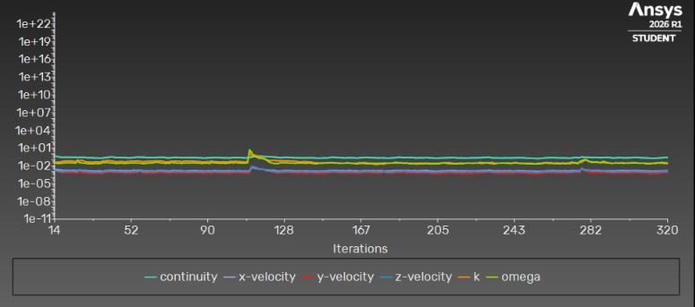

#### NACA-2412
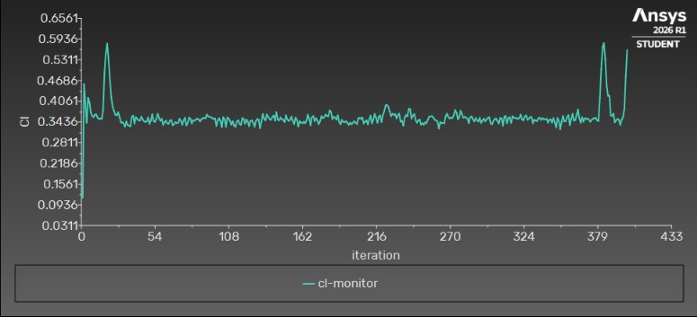

Cl monitor:

#### NACA-0012
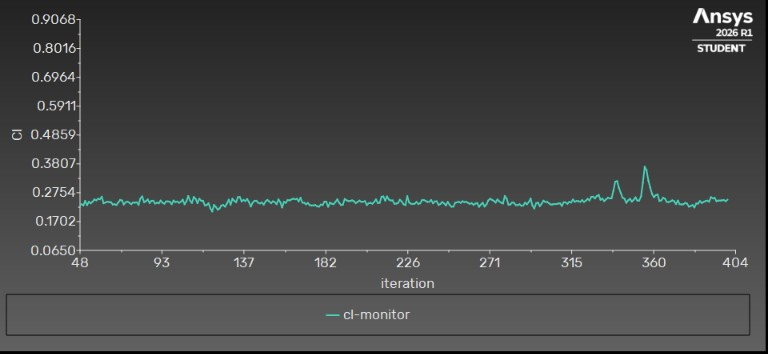

#### NACA-2412

Cd monitor:

#### NACA-0012
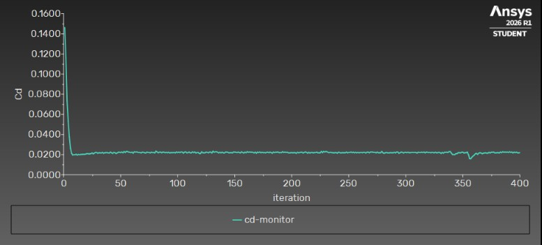

#### NACA-2412
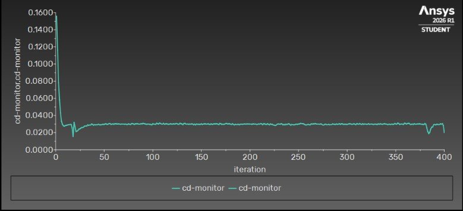

Wall y+ on the wing surface:

#### NACA-0012
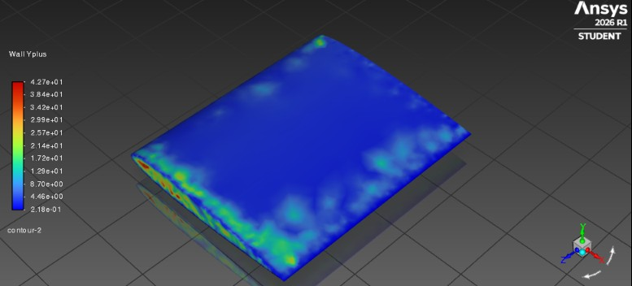

#### NACA-2412
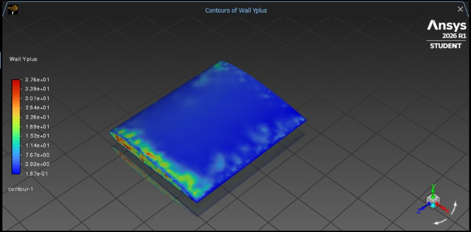

## Post-processing — α = 5° (representative case)

Wingtip vortex, visualized as velocity vectors colored by vorticity magnitude on a spanwise plane through the tip:

#### NACA-0012
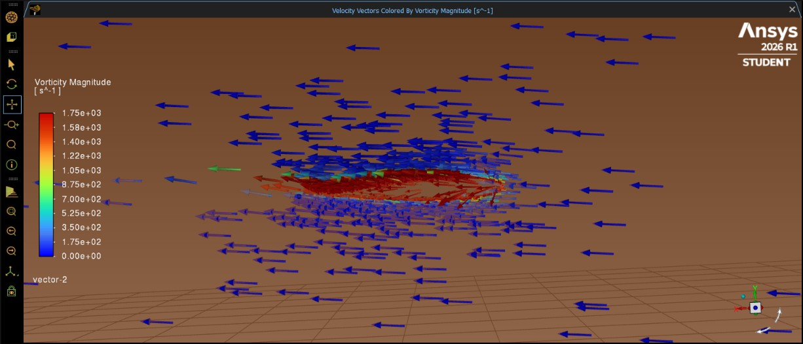

#### NACA-2412
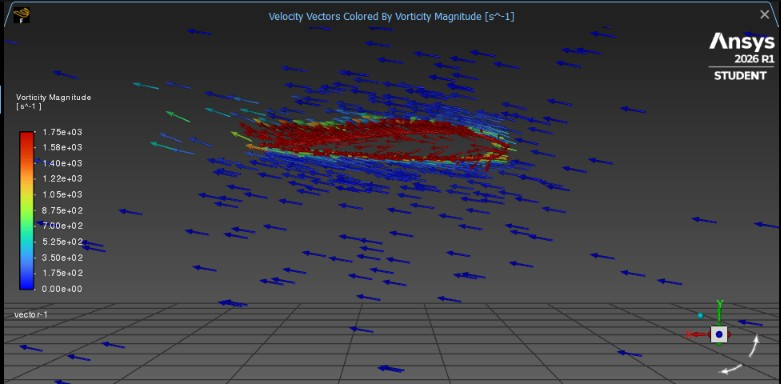

The NACA 2412 vortex core is visibly stronger and more concentrated than the NACA 0012 core at α = 5°, consistent with its higher Cl at the same angle of attack — vortex strength scales with circulation/lift.

## Notes on convergence

Cd converged cleanly to a flat line for both cases across all angles. Cl showed a bounded oscillation (roughly ±0.05 around the mean, with occasional transient spikes), consistent with the inherently less steady behavior of tip-vortex-dominated flow on a low-aspect-ratio wing in steady RANS. Reported Cl values are averaged over a stable iteration window, excluding transient spikes. The NACA 2412 α = 5° point (which deviates from the theory trend in the opposite direction to all other points) is a candidate for re-run with a longer averaging window to confirm it isn't a residual transient artifact.

## Tools used

Ansys Fluent (Student, 2026 R1), XFLR5, Ansys DesignModeler/Meshing, Excel (sweep tracking and % error calculation)

## Future work

- Extend sweep toward stall (>12°) for both airfoils to capture Clmax and stall angle in 3D, for direct comparison against the 2D XFLR5 stall behavior
- Re-run NACA 2412 at α = 5° with extended iterations to confirm the anomalous CFD > theory result
- Mesh independence study
- Spanwise Cl distribution extraction
